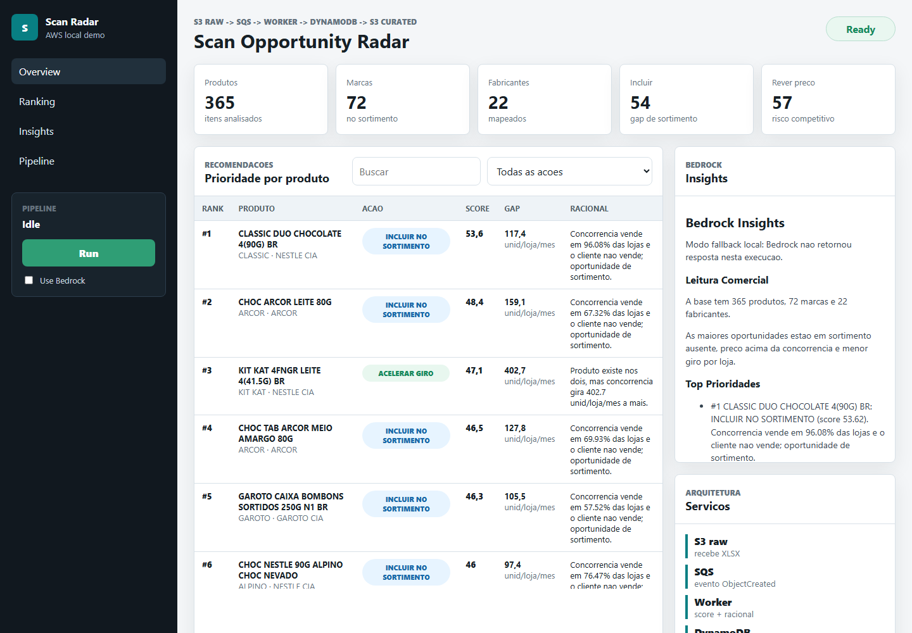
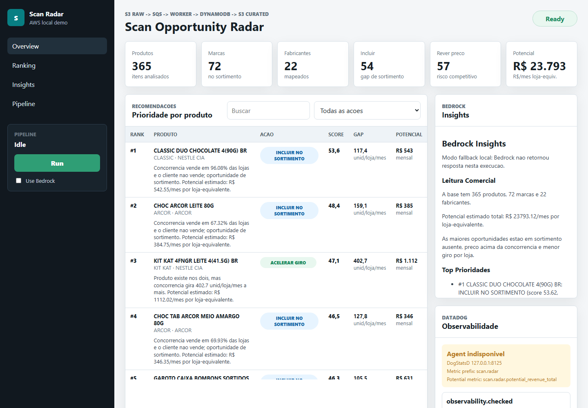
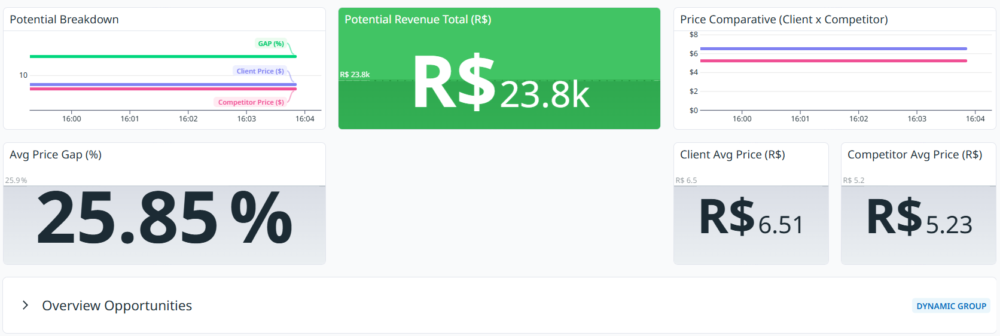

# Scan Opportunity Radar

Demo de um radar de oportunidades comerciais para a Scan. O projeto transforma
um XLSX de produtos em recomendacoes priorizadas, potencial estimado de receita
e insights acionaveis, usando Stack AWS.

> Este repositorio e uma prova de conceito local. O arquivo XLSX do case nao e
> versionado; forneca o arquivo de entrada localmente antes de executar o
> pipeline.

## Arquitetura

```text
XLSX da Scan
-> S3 raw bucket
-> evento S3 ObjectCreated
-> SQS event queue
-> worker Python
-> DynamoDB com top recomendacoes
-> S3 curated com CSV, resumo JSON, potencial de ganho e insights
```

## Recursos

- Raw bucket: `scan-case-raw`
- Curated bucket: `scan-case-curated`
- Queue: `scan-case-events`
- Table: `ScanProductRecommendations`
- Bedrock provider configurado: `meta.llama3-8b-instruct-v1:0`
- Datadog Agent local: APM `8126`, DogStatsD `8125`

## Rodar

### Pre-requisitos

- Windows PowerShell
- Python 3.10+
- Node.js 18+
- AWS CLI
- LocalStack em execucao
- Docker Desktop, para executar o LocalStack

Coloque o XLSX de entrada em `data\scan-case-input.xlsx` ou informe outro
caminho com `-SourceXlsx`.

### Pipeline

```powershell
cd C:\Users\otavi\Documents\Codex\2026-08-29\ch\outputs\scan-aws-demo
.\run-scan-demo.ps1
```

Para conferir o fluxo sem iniciar dependencias:

```powershell
.\run-scan-demo.ps1 -DryRun
```

## Abrir UI

```powershell
cd C:\Users\otavi\Documents\Codex\2026-08-29\ch\outputs\scan-aws-demo\app
npm start
```

Depois abra:

```text
http://localhost:4177
```

A UI mostra KPIs, potencial estimado, ranking de recomendacoes, filtros, insights e um botao para disparar o pipeline.

### Testes

```powershell
python -m unittest discover -s tests -p "test_*.py"
cd app
npm test
```

## Screenshots







## Potencial de Ganho

O demo calcula um potencial estimado mensal por loja-equivalente usando apenas colunas existentes na planilha: unidades por loja/mes, preco medio e presenca em lojas.

- Para produto ausente no cliente: `unidades concorrencia * preco concorrencia * % lojas concorrencia`
- Para giro ou preco: `gap positivo de unidades * preco concorrencia * % lojas concorrencia`
- Para distribuicao: `unidades concorrencia * preco concorrencia * gap de presenca`
- Para monitoramento: `0`

Esse valor nao assume margem, estoque ou numero absoluto de lojas; ele serve como indice comercial defensavel para priorizacao.

## Datadog

O app e o worker enviam metricas DogStatsD para o Agent local:

```text
scan.radar.http.request
scan.radar.http.duration_ms
scan.radar.dashboard.load_ms
scan.radar.products
scan.radar.recommendations
scan.radar.action_count
scan.radar.potential_revenue_total
scan.radar.potential_revenue
scan.radar.potential_revenue.rever_preco
scan.radar.potential_revenue.incluir_no_sortimento
scan.radar.potential_revenue.acelerar_giro
scan.radar.potential_revenue.expandir_distribuicao
scan.radar.compare.rever_preco.price_client_avg
scan.radar.compare.rever_preco.price_competitor_avg
scan.radar.compare.rever_preco.units_client_avg
scan.radar.compare.rever_preco.units_competitor_avg
scan.radar.compare.rever_preco.price_gap_pct_avg
scan.radar.run.started
scan.radar.run.completed
scan.radar.run.failed
scan.radar.run.duration_ms
scan.radar.worker.started
scan.radar.worker.completed
scan.radar.worker.duration_ms
scan.radar.worker.products
scan.radar.worker.action_count
scan.radar.worker.potential_revenue_total
scan.radar.worker.potential_revenue
scan.radar.bedrock.ok
scan.radar.bedrock.fallback
scan.radar.bedrock.skipped
```

Enquanto a UI esta aberta pelo servidor Node, o app republica o snapshot de negocio a cada 15 segundos. Isso evita grafico com um unico ponto no Datadog para metricas de gauge como `scan.radar.potential_revenue_total`.

Para comparar `REVER PRECO`, use dois widgets:

```text
max:scan.radar.compare.rever_preco.price_client_avg{service:scan-opportunity-radar}
max:scan.radar.compare.rever_preco.price_competitor_avg{service:scan-opportunity-radar}
```

```text
max:scan.radar.compare.rever_preco.units_client_avg{service:scan-opportunity-radar}
max:scan.radar.compare.rever_preco.units_competitor_avg{service:scan-opportunity-radar}
```

Tambem grava eventos auditaveis em:

```text
run-state\observability\events.jsonl
```

A UI consulta `/api/observability` e mostra versao do Agent, portas e ultimos eventos.

## Tentar Bedrock Runtime

Por padrao, o script deixa o provider configurado mas nao chama o runtime, para evitar travamento quando o `bedrock-runtime` do LocalStack ainda esta `starting`.

Quando o provider estiver pronto:

```powershell
.\run-scan-demo.ps1 -UseBedrock
```

## Outputs Locais

- `run-state\curated\scan_product_recommendations.csv`
- `run-state\curated\scan_demo_summary.json`
- `run-state\curated\bedrock_insights.md`

## Resultado Validado

O processamento gerou:

- 365 produtos analisados
- 72 marcas
- 22 fabricantes
- 54 recomendacoes de incluir no sortimento
- 57 recomendacoes de rever preco
- 13 recomendacoes de acelerar giro
- 13 recomendacoes de expandir distribuicao
- R$ 23.793,12/mes de potencial estimado por loja-equivalente

Top 3 do ranking:

1. `CLASSIC DUO CHOCOLATE 4(90G) BR` - incluir no sortimento
2. `CHOC ARCOR LEITE 80G` - incluir no sortimento
3. `KIT KAT 4FNGR LEITE 4(41.5G) BR` - acelerar giro

Top 3 por potencial:

1. `KIT KAT 4FNGR LEITE 4(41.5G) BR` - R$ 1.112,02/mes
2. `NESTLE ESPECIALIDADES BOMBONS 251G BR` - R$ 982,32/mes
3. `CHOCOLATE AO LEITE NEUGEBAUER PACOTE 90G` - R$ 953,54/mes
